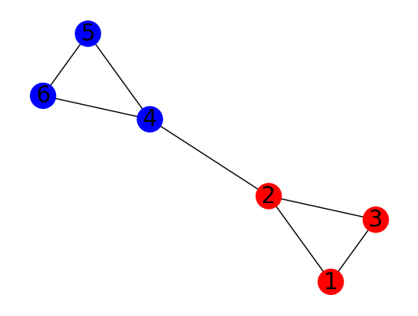
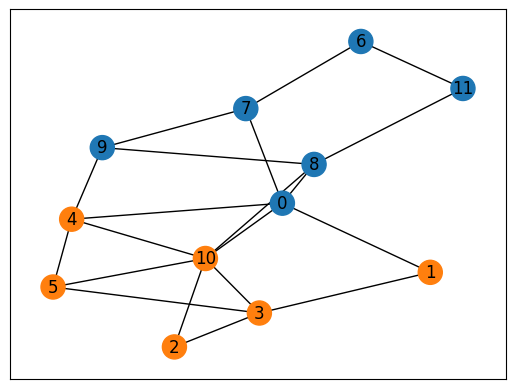

--- 
description: Here we show how to solve the graph partitioning problem using JijZept and JijModeling.
---

# Graph Partitioning

Here we show how to solve the graph partitioning problem using JijZept and [JijModeling](https://www.ref.documentation.jijzept.com/jijmodeling/). 
This problem is also mentioned in 2.2. Graph Partitioning on [Lucas, 2014, "Ising formulations of many NP problems"](https://www.frontiersin.org/articles/10.3389/fphy.2014.00005/full).

## What is Graph Partitioning?

Graph partitioning is the problem of dividing a graph into two subsets of equal size with the aim of minimizing the number of edges between the subsets.

### Example

Let us take a look at the following situation.
Consider a graph with 6 vertices labeled from 1 to 6, and edges connecting vertices as follows:
- 1 is connected to 2 and 3
- 2 is connected to 1, 3, and 4
- 3 is connected to 1 and 2
- 4 is connected to 2, 5, and 6
- 5 is connected to 4 and 6
- 6 is connected to 4 and 5

The goal is to partition this graph into two subsets of equal size (i.e., 3 vertices in each subset) with minimized edges between them.
In this case, the optimal solution is $\{1, 2, 3\}, \{4, 5, 6\}$, where there is only 1 edge connecting vertices in different subsets (i.e., the edge (2,4)), which is the minimum possible number of edges connecting the two subsets. 




### Mathematical Model

Let $G=(V, E)$ be the undirected graph where $V$ is the set of vertices and $E$ is the set of edges.
The goal is to partition $V$ into two subsets $V_1$ and $V_2$ of equal size, with the number of edges crossing the partition being minimized.
We introduce variables $x_{u}$ which is 1 if vertex $u$ is in the subset $V_1$ and 0 if vertex $u$ is in the subset $V_2$.

**Constraint: the vertices must be partitioined into two equal-sized sets**

We express this constraint as follows:

$$
∑_{u \in V} x_u = V/2 \tag{1}
$$

**Objective function: minimize the number of edges crossing the partition**

$$
\min \quad 
\sum_{(uv) \in E} (\{x_{u} (1-x_{v})\}+\{(1-x_{u}) x_{v}\})
 \tag{2}
$$

Here, the first term $x_u (1 - x_v)$ evaluates to 1 if edge (u, v) crosses the boundary between $V_1$ and $V_2$ (i.e., if $u$ belongs to $V_2$ and $v$ belongs to $V_1$), and 0 otherwise. Similarly, the second term $(1 - x_u) x_v$ evaluates to 1 if edge (u, v) crosses the boundary between $V_1$ and $V_2$ (i.e., if $u$ belongs to $V_1$ and $v$ belongs to $V_2$), and 0 otherwise.

Thus, this objective function is an indicator of how much graph partitioning has been achieved.

## Modeling by JijModeling

Next, we show an implementation using JijModeling. We first define variables for the mathematical model described above.


```python
import jijmodeling as jm

# define variables
V = jm.Placeholder('V')
E = jm.Placeholder('E', ndim=2)
x = jm.BinaryVar('x', shape=(V,))
u = jm.Element('u', belong_to=V)
e = jm.Element('e', belong_to=E)
```

`V=jm.Placeholder('V')` represents the number of vertices. 
We denote `E=jm.Placeholder('E', ndim=2)` as a set of edges.
Then, we define a list of binary variables `x=jm.BinaryVar('x', shape=(V,))`, and we set the subscripts `u` used in the mathematical model.
Finally, `e` represents the variable for edges. `e[0]` and `e[1]` represent the two vertices connected by the edge.

### Constraint

We implement a constraint Equation (1).


```python
# set problem
problem = jm.Problem('Graph Partitioning')
# set constraint: the vertices must be partitioined into two equal-sized sets
const = jm.sum(u, x[u])
problem += jm.Constraint('constraint', const==V/2)
```

### Objective function

Next, we implement an objective function Equation (2).


```python
# set objective function: minimize the number of edges crossing the partition
A_1 = x[e[0]]*(1-x[e[1]])
A_2 = (1-x[e[0]])*x[e[1]]
problem += jm.sum(e, (A_1 + A_2))
```

Let's display the implemented mathematical model in Jupyter Notebook.


```python
problem
```


$$\begin{array}{cccc}\text{Problem:} & \text{Graph Partitioning} & & \\& & \min \quad \displaystyle \sum_{e \in E} \left(x_{e_{0}} \cdot \left(- x_{e_{1}} + 1\right) + \left(- x_{e_{0}} + 1\right) \cdot x_{e_{1}}\right) & \\\text{{s.t.}} & & & \\ & \text{constraint} & \displaystyle \sum_{u = 0}^{V - 1} x_{u} = V \cdot 2^{(-1)} &  \\\text{{where}} & & & \\& x & 1\text{-dim binary variable}\\\end{array}$$


## Prepare an instance

We prepare a graph using [NetworkX](https://networkx.org/). 
Here we create random graph with 12 vertices.


```python
import networkx as nx

# set the number of vertices
inst_V = 12
# create a random graph
inst_G = nx.gnp_random_graph(inst_V, 0.4)
# get information of edges
inst_E = [list(edge) for edge in inst_G.edges]
instance_data = {'V': inst_V, 'E': inst_E}
```

## Solve by JijZept's SA

We solve this problem using JijZept `JijSASampler`. We also use the parameter search function by setting `search=True`.


```python
import jijzept as jz

# set sampler
config_path = "config.toml"
sampler = jz.JijSASampler(config=config_path)
# solve problem
response = sampler.sample_model(problem, instance_data, multipliers={"constraint": 0.5}, num_reads=100, search=True)
```

## Visualize the solution

In the end, we extract the lowest energy solution from the feasible solutions and visualize it.


```python
import matplotlib.pyplot as plt
import numpy as np

# get sampleset which is returned from JijZept
sampleset = response.get_sampleset()
# extract feasible samples
feasible_samples = sampleset.feasibles()
# get the values of feasible objective function
feasible_objectives = [sample.eval.objective for sample in feasible_samples]

if len(feasible_objectives) == 0:
    print("No feasible sample found ...")
else:
    # get the lowest index
    lowest_index = np.argmin(feasible_objectives)
    print("Objective: ", feasible_objectives[lowest_index])
    # get the solution of lowest index
    lowest_solution = feasible_samples[lowest_index].var_values["x"].values
    # get the index of x == 1
    x_indices = [key[0] for key in lowest_solution.keys()]
    # set color list for visualization
    cmap = plt.get_cmap("tab10")
    # initialize vertex color list
    node_colors = [cmap(0)] * instance_data["V"]
    # set vertex color list
    for i in x_indices:
        node_colors[i] = cmap(1)
    # make figure
    nx.draw_networkx(inst_G, node_color=node_colors, with_labels=True)
    plt.show()
```

    Objective:  5.0


    

    


With the above visualization, we obtain a feasible partitioning for this graph.
