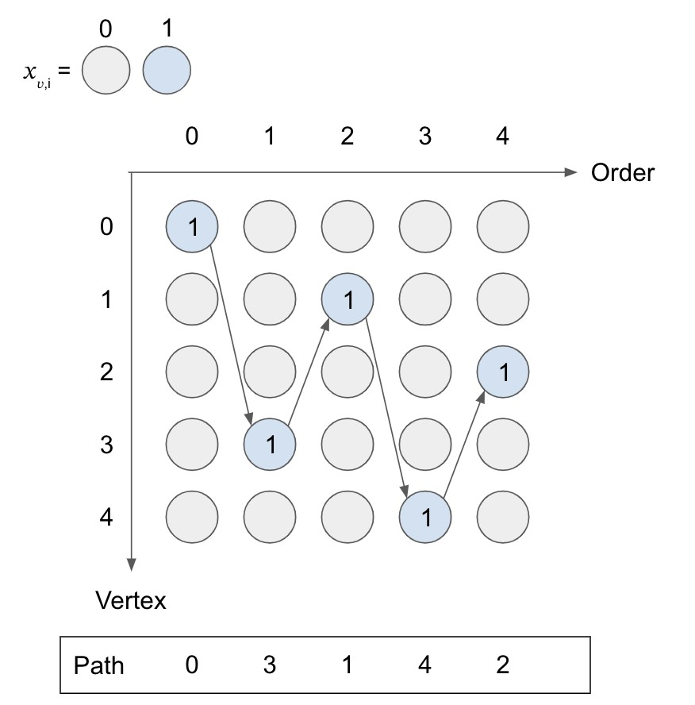
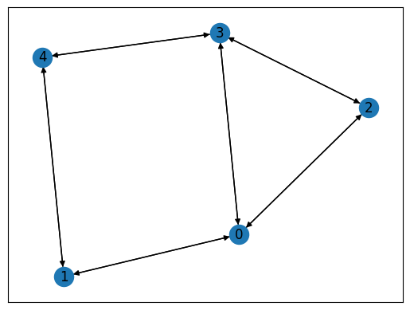
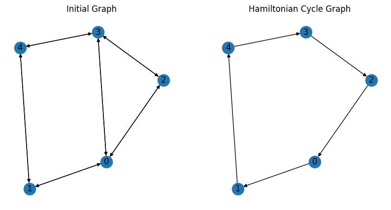

--- 
description: Here we show how to solve Hamiltonian cycles and paths problem using JijZept and JijModeling.
---

# Hamiltonian Cycles and Paths

Here we show how to solve the Hamiltonian cycles and paths problem using JijZept and [JijModeling](https://www.ref.documentation.jijzept.com/jijmodeling/).
This problem is also mentioned in 7.1. Hamiltonian Cycles and Paths on [Lucas, 2014, "Ising formulations of many NP problems"](https://www.frontiersin.org/articles/10.3389/fphy.2014.00005/full).

## What are Hamiltonian Cycles and Paths?

The Hamiltonian path problem is defined as follows.
Starting from a vertex in given graph, make a travel along the edges so that the traveler visits every vertex exactly once.
The Hamiltonian cycles problem requires in addition that the traveler should return to the starting vertex (*i.e.* the traveler visits the starting point twice.).
Note that the graph can either be directed or undirected.


## Mathematical model

Without loss of generality, we label the vertices by $1, \cdots , V$ and assume the edges are directed; *i.e.* $(uv)$ and $(vu)$ denote different edges from each other.
For the given graph $G = (V, E)$, we consider that a vertex $v$ is visited in the $i$-th step if a binary variable $x_{v,i}$ is $1$, and vice versa.

**Constraint 1: every vertex in the graph must be visited exactly once**

This constraint can be formulated in a quite simple way:

$$
\quad \sum_{i=1}^V x_{v, i}  = 1 \quad \text{for } v = 1, \cdots , V.
$$

**Constraint 2: the path must be connected**

This means that there must be only one $i$-th vertex in the cycle for each $i$.

$$
\quad \sum_{v=1}^V x_{v, i} = 1 \quad \text{for } v = 1, \cdots , V.
$$

The following figure illustrates a valid path,
and you can count the number of variables that take $1$ for each row and column to confirm the above two conditions held.



**Constraint 3: an edge $(u, v)$ must be in $G$ if it is used in the path**

If an edge $(u,v)$ is used in the path, both $x_{u,i}$ and $x_{v,i+1}$ take $1$,
so that this constraint is formulated as below.

$$
\quad \sum_{(u,v) \notin E} \sum_{i=1}^{V} x_{u,i} x_{v, (i+1)\%V} = 0
$$

Note that this constraint should be considered for the Hamiltonian cycles problem.
As for the Hamiltonian paths problem instead, one relaxes the condition a bit by changing $\sum_{i=1}^V$ to $\sum_{i=1}^{V-1}$;
this means that we do not have to care about the edge between the first and the last vertices.


## Modeling by JijModeling

We show how to implement above equations using JijModeling.
We first define the variables in the mathematical model described above.


```python
import jijmodeling as jm

# define variables
V = jm.Placeholder('V')
barE = jm.Placeholder('barE', ndim=2)
num_barE = barE.shape[0]
i = jm.Element('i', V)
v = jm.Element('v', V)
x = jm.BinaryVar('x', shape=(V, V))
f = jm.Element('f', num_barE)
```

The constraints are written as:


```python
problem = jm.Problem("Hamiltonian Cycles")
problem += jm.Constraint('one-vertex', x[v, :].sum()==1, forall=v)
problem += jm.Constraint('one-path', x[:, i].sum()==1, forall=i)
problem += jm.Constraint('one-edge', jm.sum([f,i], x[barE[f][0],i]*x[barE[f][1],(i+1)%V])==0)
```

On Jupyter Notebook, one can check the problem statement in a human-readable way by hitting


```python
problem
```


$$\begin{array}{cccc}\text{Problem:} & \text{Hamiltonian Cycles} & & \\& & \min \quad \displaystyle 0 & \\\text{{s.t.}} & & & \\ & \text{one-edge} & \displaystyle \sum_{f = 0}^{\mathrm{len}\left(barE, 0\right) - 1} \sum_{i = 0}^{V - 1} x_{barE_{f, 0}, i} \cdot x_{barE_{f, 1}, \left(i + 1\right) \bmod V} = 0 &  \\ & \text{one-path} & \displaystyle \sum_{\ast_{0} = 0}^{V - 1} x_{\ast_{0}, i} = 1 & \forall i \in \left\{0,\ldots,V - 1\right\} \\ & \text{one-vertex} & \displaystyle \sum_{\ast_{1} = 0}^{V - 1} x_{v, \ast_{1}} = 1 & \forall v \in \left\{0,\ldots,V - 1\right\} \\\text{{where}} & & & \\& x & 2\text{-dim binary variable}\\\end{array}$$


## Prepare an instance

We prepare a graph using [Networkx](https://networkx.org/).


```python
import networkx as nx

# set empty graph
inst_G = nx.DiGraph()
# add edges
for u,v in [[0,1], [0,2], [0,3], [1,4], [2,3], [3,4]]:
    inst_G.add_edge(u,v)
    inst_G.add_edge(v,u)
inst_barE = []
for u,v in list(nx.complement(inst_G).edges):
    inst_barE.append([u,v])

# get the number of vertex
inst_V = list(inst_G.nodes)
num_V = len(inst_V)

instance_data = {'V': num_V, 'barE': inst_barE}

```

This graph is shown below.


```python
import matplotlib.pyplot as plt

# Compute the layout
pos = nx.spring_layout(inst_G)

nx.draw_networkx(inst_G, pos=pos, with_labels=True)
plt.show()
```


    

    


## Solve by JijZept's SA

We solve this problem using JijSASampler.


```python
import jijzept as jz

# set sampler
sampler = jz.JijSASampler(config="../../../config.toml")
# solve problem
response = sampler.sample_model(problem, instance_data, multipliers={"one-vertex": 0.5, "one-path": 0.5, "one-edge": 0.5}, search=True, num_reads=100)
```

## Visualize the solution

The result can be seen as below.


```python
import matplotlib.pyplot as plt

# get sampleset
sampleset = response.get_sampleset()
# extract feasible samples
feasible_samples = sampleset.feasibles()
if len(feasible_samples) == 0:
    print("No feasible sample found ...")
else:
    # get a feasible solution
    feasible_solution = feasible_samples[0].var_values["x"].values
    # get the indices of x == 1
    x_indices = feasible_solution.keys()
    # sort by time step
    path = [index for index, _ in sorted(x_indices, key=lambda x: x[1])]
    # append start point
    path.append(path[0])    
    # make the directed graph from paths
    inst_DG = nx.DiGraph()
    inst_DG.add_edges_from([(path[i], path[i+1]) for i in range(len(path)-1)])
    # create the figure with two subplots
    fig, (ax1, ax2) = plt.subplots(1, 2, figsize=(10, 5))
    # draw the initial graph
    nx.draw_networkx(inst_G, pos, with_labels=True, ax=ax1)
    ax1.set_title('Initial Graph')
    plt.axis('off')
    ax1.set_frame_on(False) # Remove the frame from the first subplot
    # draw the directed graph
    nx.draw_networkx_nodes(inst_DG, pos)
    nx.draw_networkx_edges(inst_DG, pos, arrows=True)
    nx.draw_networkx_labels(inst_DG, pos)
    plt.axis('off')
    ax2.set_title('Hamiltonian Cycle Graph')
    # show the graphs
    plt.show()
```


    

    


As expected, we obtain a Hamiltonian cycle.
