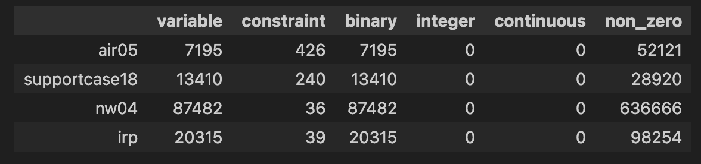

--- 
description: JijModeling can read mathematical models and their instances defined in MPS files.
pagination_next: null
---

# Data Loader for MPS format files

<!-- [Mathematical Programming System (MPS)](https://www.ibm.com/docs/en/icos/22.1.1?topic=cplex-mps-file-format-industry-standard)は線形計画問題や混合整数計画問題で用いられるファイル形式の一つです。
JijModelingは[MPS](https://www.ibm.com/docs/en/icos/22.1.1?topic=cplex-mps-file-format-industry-standard)ファイルに定義されている数理モデルとそのインスタンスを読み込む機能を持ちます。
以下ではその簡単な利用方法をご紹介します。 -->

[Mathematical Programming System (MPS)](https://www.ibm.com/docs/en/icos/22.1.1?topic=cplex-mps-file-format-industry-standard) is one of the file formats used in linear programming (LP) and mixed-integer programming (MIP) problems.
JijModeling can read mathematical models and their instances defined in [MPS files](https://www.ibm.com/docs/en/icos/22.1.1?topic=cplex-mps-file-format-industry-standard).
We describe a brief use of a function for [MPS files](https://www.ibm.com/docs/en/icos/22.1.1?topic=cplex-mps-file-format-industry-standard).

<!-- ## MIPLIBデータセットの取得 -->

## Getting MIPLIB Dataset

<!-- ここでは以下のようにして、[MIPLIB benchmark set](https://miplib.zib.de/tag_benchmark.html)を取得してみましょう。 -->

We can get MIPLIB benchmark set as follows: 


```python
import jijmodeling.dataset

miplib = jijmodeling.dataset.Miplib()
```

<!-- `instance_statistics`を用いることで、[MIPLIB benchmark set](https://miplib.zib.de/tag_benchmark.html)の統計データを取得することができます。
制約数やバイナリ変数の数、整数変数の数などの情報の閲覧が可能です。
ここでは、連続変数の数が0個、そして制約の数が500個未満のデータのみを表示しています。 -->

We can also use `instance_statistics` to obtain statistics on [MIPLIB benchmark set](https://miplib.zib.de/tag_benchmark.html).
We check information such as the number of constraints, the number of binary variables, and the number of integer variables.
Here, only data with zero number of continuous variables and less than 500 constraints are displayed.


```python
import pandas as pd

df = pd.DataFrame(miplib.instance_statistics).T
df[(df["integer"]==0)&(df["continuous"]==0)&(df["constraint"]<500)]
```





<!-- ## MPS形式データの読み込み -->

## Loading MPS format files

<!-- 先ほど取得したデータセットの中から"air05"を読み込んでみましょう。
それには`load`を用います。 -->

We load "air05" from MIPLIB dataset.


```python
problem, instance_data = miplib.load("air05")
```

<!-- この`load`は、[JijModelingの`Problem`](https://www.documentation.jijzept.com/docs/jijmodelingtranspiler/references/jijmodeling_transpiler/core/compile/compiled_model#class-problem)と、それに対応したインスタンスデータを戻り値として返します。そのため、Jupyter Notebook上であれば、実際にどのような数理モデルが読み込まれたかを確認することができます。 -->

`load` returns [JijModeling `Problem`](https://www.documentation.jijzept.com/docs/jijmodelingtranspiler/references/jijmodeling_transpiler/core/compile/compiled_model#class-problem) and the corresponding instance data.  
With Jupyter Notebook, we can check the mathematical model loaded.


```python
problem
```


$$\begin{array}{cccc}\text{Problem:} & \text{air05} & & \\& & \min \quad \displaystyle \sum_{i = 0}^{N^B - 1} c^B_{i} \cdot x^B_{i} & \\\text{{s.t.}} & & & \\ & \text{Equality constraint} & \displaystyle \sum_{i = 0}^{\mathrm{len}\left(e^B_{eq_{j}}, 0\right) - 1} e^B_{eq_{j}, i} \cdot x^B_{col^B_{eq_{j}, i}} = b_{eq_{j}} & \forall j \in \left\{0,\ldots,\mathrm{len}\left(eq, 0\right) - 1\right\} \\ & \text{Inequality constraint (<=)} & \displaystyle \sum_{i = 0}^{\mathrm{len}\left(e^B_{lte_{j}}, 0\right) - 1} e^B_{lte_{j}, i} \cdot x^B_{col^B_{lte_{j}, i}} \leq b_{lte_{j}} & \forall j \in \left\{0,\ldots,\mathrm{len}\left(lte, 0\right) - 1\right\} \\ & \text{Inequality constraint (>=)} & \displaystyle \sum_{i = 0}^{\mathrm{len}\left(e^B_{gte_{j}}, 0\right) - 1} e^B_{gte_{j}, i} \cdot x^B_{col^B_{gte_{j}, i}} \geq b_{gte_{j}} & \forall j \in \left\{0,\ldots,\mathrm{len}\left(gte, 0\right) - 1\right\} \\\text{{where}} & & & \\& x^B & 1\text{-dim binary variable}& \text{Binary variables}\\\end{array}$$


<!-- この問題を、JijZeptで解いてみましょう。 -->

We solve this problem using JijZept.


```python
import jijzept as jz

# set sampler
sampler = jz.JijSASampler(config='config.toml')
# solve problem
response = sampler.sample_model(problem, instance_data, max_wait_time=600)
```

<!-- 出力された結果の中から、実行可能解を選び出しましょう。 -->

We select feasible solutions from the output results.


```python
# get sample
sampleset = response.get_sampleset()
sample = sampleset[0]
# check the value of objective function
print(f"objective: {sample.eval.objective}")
# check the violations
constraints = sample.eval.constraints
print(f"Equality constraint: {constraints['Equality constraint'].total_violation}")
print(f"Inequality constraint (<=): {constraints['Inequality constraint (<=)'].total_violation}")
print(f"Inequality constraint (>=): {constraints['Inequality constraint (>=)'].total_violation}")
```

    objective: 42087.0
    Equality constraint: 17.0
    Inequality constraint (<=): 0.0
    Inequality constraint (>=): 0.0


<!-- JijModelingの機能を用いることで、[MIPLIBデータセット](https://miplib.zib.de/index.html)や外部出力された[MPSファイル](https://www.ibm.com/docs/en/icos/22.1.1?topic=cplex-mps-file-format-industry-standard)の読み込みをすることができます。 -->

Using JijModeling function, it is possible to read in [MIPLIB data set](https://miplib.zib.de/index.html) and [MPS files](https://www.ibm.com/docs/en/icos/22.1.1?topic=cplex-mps-file-format-industry-standard).

<!-- ## 参考文献 -->

## References

[1] [MPS file format](https://www.ibm.com/docs/en/icos/22.1.1?topic=cplex-mps-file-format-industry-standard)  
[2] [MIPLIB 2017](https://miplib.zib.de/index.html)  


