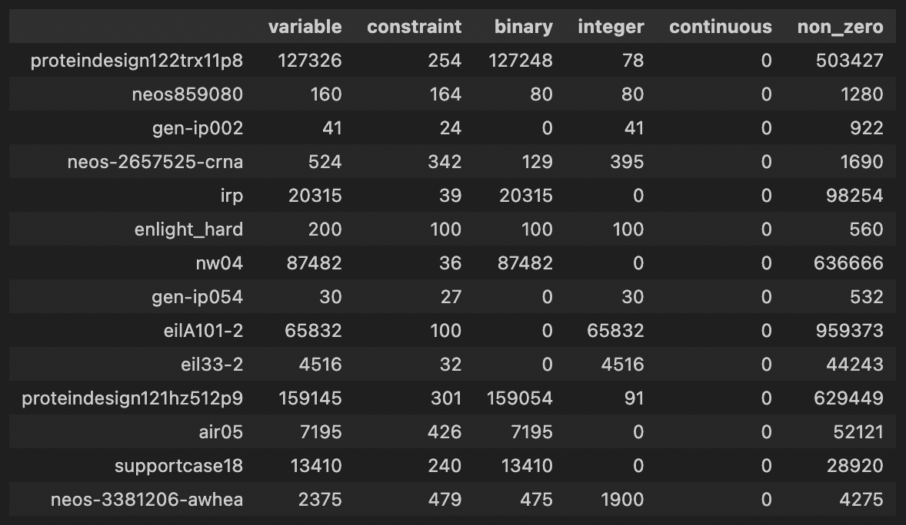

--- 
description: JijModeling can read mathematical models and their instances defined in MPS files.
pagination_next: null
---

# Data Loader for MPS format files

[Mathematical Programming System (MPS)](https://www.ibm.com/docs/en/icos/22.1.1?topic=cplex-mps-file-format-industry-standard) is one of the file formats used in linear programming (LP) and mixed-integer programming (MIP) problems.
JijModeling can read mathematical models and their instances defined in [MPS files](https://www.ibm.com/docs/en/icos/22.1.1?topic=cplex-mps-file-format-industry-standard).
We describe a brief use of a function for [MPS files](https://www.ibm.com/docs/en/icos/22.1.1?topic=cplex-mps-file-format-industry-standard).

## Getting MIPLIB Dataset

We can get MIPLIB benchmark set as follows: 

```python
import jijmodeling.dataset

miplib = jijmodeling.dataset.Miplib()
```

We can also use `instance_statistics` to obtain statistics on [MIPLIB benchmark set](https://miplib.zib.de/tag_benchmark.html).
We check information such as the number of constraints, the number of binary variables, and the number of integer variables.
Here, only data with zero number of continuous variables and less than 500 constraints are displayed.

```python
import pandas as pd

df = pd.DataFrame(miplib.instance_statistics).T
df[(df["continuous"]==0)&(df["constraint"]<500)]
```



## Loading MPS format files

We load "gen-ip002" from MIPLIB dataset.

```python
problem, instance_data = miplib.load("gen-ip002")
```

`load` returns [JijModeling `Problem`](https://www.documentation.jijzept.com/docs/jijmodelingtranspiler/references/jijmodeling_transpiler/core/compile/compiled_model#class-problem) and the corresponding instance data.  
With Jupyter Notebook, we can check the mathematical model loaded.

```python
problem
```

$$\begin{array}{cccc}\text{Problem:} & \text{gen-ip002} & & \\& & \min \quad \displaystyle \sum_{i^I = 0}^{N^I - 1} c^I_{i^I} \cdot x^I_{i^I} & \\\text{{s.t.}} & & & \\ & \text{Inequality constraint (<=)} & \displaystyle \sum_{i^I = 0}^{N^I - 1} a^{I\le}_{j^\le, i^I} \cdot x^I_{i^I} \leq b^\le_{j^\le} & \forall j^\le \in \left\{0,\ldots,M^\le - 1\right\} \\\text{{where}} & & & \\& x^I & 1\text{-dim integer variable}& \text{Integer variables}\\ & & \text{lower bound: }l^I & \\ & & \text{upper bound: }u^I & \\\end{array}$$

We solve this problem using JijZept.

```python
import jijzept as jz

# set sampler
sampler = jz.JijSASampler(config='../config.toml')
# solve problem
results = sampler.sample_model(problem, instance_data, search=True, num_reads=100)
```

We select feasible solutions from the output results.

```python
# get feasible solutions
feasibles = results.feasible()
if feasibles.evaluation.objective.size == 0:
    print("No feasibles solution")
else:
    feas_objs = feasibles.evaluation.objective
    print(min(feas_objs))    
```

0.0

Using JijModeling function, it is possible to read in [MIPLIB data set](https://miplib.zib.de/index.html) and [MPS files](https://www.ibm.com/docs/en/icos/22.1.1?topic=cplex-mps-file-format-industry-standard).

## References

[1] [MPS file format](https://www.ibm.com/docs/en/icos/22.1.1?topic=cplex-mps-file-format-industry-standard)  
[2] [MIPLIB 2017](https://miplib.zib.de/index.html)  